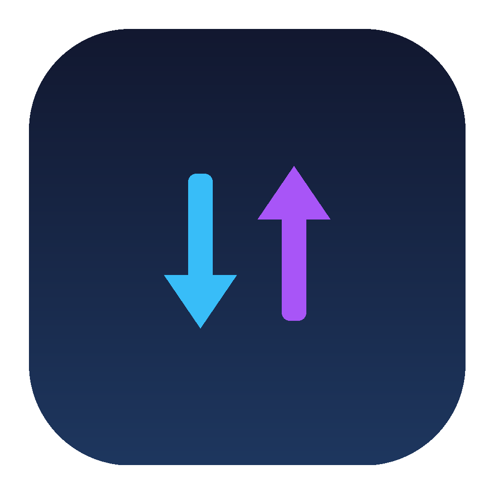

# [Cepaty](https://github.com/januarsyah901/cepaty)

[](https://github.com/januarsyah901/cepaty/actions/workflows/ci.yml)
[](https://www.apple.com/macos/)
[](https://swift.org)
[](LICENSE)
[](https://github.com/januarsyah901/cepaty/releases)
[](https://saweria.co/januarsyah)

Cepaty adalah aplikasi pemantau lalu lintas jaringan yang sangat ringan untuk macOS. Aplikasi ini berdiam di menu bar Anda, menampilkan kecepatan unduh dan unggah secara langsung per aplikasi tanpa membutuhkan akses root maupun ekstensi kernel tambahan.

Cepaty berjalan pada macOS Ventura 13 atau versi lebih baru (Apple Silicon & Intel).

<!-- vim-markdown-toc GFM -->

* [Fitur](#fitur)
* [Pemasangan](#pemasangan)
  * [Unduh Installer DMG](#unduh-installer-dmg)
  * [Kompilasi dari Source](#kompilasi-dari-source)
* [Cara Penggunaan](#cara-penggunaan)
* [Arsitektur & Cara Kerja](#arsitektur--cara-kerja)
  * [Snapshot Diskrit Hemat Daya](#snapshot-diskrit-hemat-daya)
  * [Pengelompokan Sub-proses](#pengelompokan-sub-proses)
* [Tanya Jawab (FAQ)](#tanya-jawab-faq)
  * [Apakah Cepaty membutuhkan izin root atau sudo?](#apakah-cepaty-membutuhkan-izin-root-atau-sudo)
  * [Mengapa proses Chrome Helper dan Slack Renderer digabung?](#mengapa-proses-chrome-helper-dan-slack-renderer-digabung)
  * [Bagaimana Cepaty menjaga penggunaan CPU tetap 0.0%?](#bagaimana-cepaty-menjaga-penggunaan-cpu-tetap-00)
  * [Bagaimana cara menyalakan fitur buka saat login?](#bagaimana-cara-menyalakan-fitur-buka-saat-login)
* [Pengujian Unit](#pengujian-unit)
* [Struktur Berkas](#struktur-berkas)
* [Dukungan (Sponsor)](#dukungan-sponsor)
* [Lisensi](#lisensi)

<!-- vim-markdown-toc -->

## Fitur

* ⚡ **Ringan dan Cepat**: Konsumsi CPU tercatat **0.0%** di latar belakang, memori hanya sekitar ~45 MB.
* 📊 **Live Speed Monospaced**: Angka download dan upload (`↓ …  ↑ …`) di status bar tidak bergetar saat digit berubah.
* 🧩 **Per-App Traffic**: Menampilkan daftar aplikasi yang memakai kuota lengkap dengan ikon asli macOS.
* 🗂️ **Dua Mode Urutan**: Beralih instan antara kecepatan aktif (**Sekarang**) dan total kuota (**Total**).
* 🛡️ **Aman dan Privat**: Berjalan 100% lokal, tanpa packet filtering, tanpa pengiriman data keluar.
* 🚀 **Native UI**: Murni dibangun dengan SwiftUI dan AppKit tanpa ketergantungan Electron atau webview.
* 🔓 **Open Source**: Bebas dipakai dan dikembangkan dengan lisensi terbuka MIT.

## Pemasangan

### Unduh Installer DMG

1. Unduh berkas installer terbaru dari halaman [Releases](https://github.com/januarsyah901/cepaty/releases/latest).
2. Buka berkas `Cepaty-1.0.0.dmg`.
3. Tarik ikon `Cepaty.app` ke dalam pintasan folder `Applications`.
4. Buka Cepaty lewat Spotlight atau Launchpad.

### Kompilasi dari Source

Pastikan Xcode Command Line Tools sudah aktif di Mac Anda. Jalankan perintah berikut di terminal:

```sh
# Clone repositori
git clone https://github.com/januarsyah901/cepaty.git
cd cepaty

# Jalankan unit test
./build.sh test

# Bangun aplikasi dan pasang ke /Applications
./package_app.sh
```

## Cara Penggunaan

1. Klik teks status `↓ 0 B/s  ↑ 0 B/s` pada menu bar kanan atas Mac Anda untuk membuka jendela popover.
2. Klik tombol tab <kbd>Sekarang</kbd> guna meninjau aplikasi yang sedang aktif menyedot bandwidth saat ini.
3. Klik tombol tab <kbd>Total</kbd> guna memantau aplikasi mana yang paling boros kuota sepanjang sesi berlangsung.
4. Centang opsi <kbd>Buka saat login</kbd> agar Cepaty menyala otomatis saat Mac pertama kali dinyalakan.
5. Tekan pintasan <kbd>COMMAND (⌘)</kbd> + <kbd>Q</kbd> atau klik tombol **Keluar** di bagian bawah popover untuk menutup aplikasi.

## Arsitektur & Cara Kerja

Cepaty memadukan utilitas diagnosa bawaan macOS dengan kalkulasi delta yang efisien.

```text
                  ┌────────────────────────┐
                  │    macOS Network       │
                  │   (/usr/bin/nettop)    │
                  └───────────┬────────────┘
                              │ Snapshot 25ms (-L 1)
                              ▼
                  ┌────────────────────────┐
                  │     NettopSampler      │  (Background Queue)
                  └───────────┬────────────┘
                              │ Parsed Samples
                              ▼
                  ┌────────────────────────┐
                  │   TrafficAggregator    │  (Delta & Baseline Calc)
                  └───────────┬────────────┘
                              │ Resolved App Traffic
                              ▼
                  ┌────────────────────────┐
                  │    TrafficViewModel    │  (Main Thread State)
                  └───────────┬────────────┘
                              │ Reactive Updates
              ┌───────────────┴───────────────┐
              ▼                               ▼
     ┌─────────────────┐             ┌─────────────────┐
     │   MenuBarLabel  │             │ TrafficPopover  │
     └─────────────────┘             └─────────────────┘
```

### Snapshot Diskrit Hemat Daya

Mode streaming bawaan `nettop` (`-L 0`) pada versi macOS modern kerap memicu *spin loop* yang memakan CPU hingga puluhan persen.

Cepaty mengatasi kendala ini lewat pendekatan **periodic snapshot**:
1. Menjalankan `nettop -P -n -x -L 1 -J bytes_in,bytes_out` setiap interval (5 detik saat di latar belakang, 1 detik saat popover dibuka).
2. Perintah hanya berjalan sekitar 25 milidetik untuk membaca snapshot socket kernel, lalu proses langsung berakhir.
3. [TrafficAggregator.swift](Sources/Cepaty/Core/TrafficAggregator.swift) menghitung selisih byte kumulatif antar snapshot secara mandiri.
4. Baterai laptop Anda tetap awet dan CPU tidak terbebani.

### Pengelompokan Sub-proses

Aplikasi modern seperti browser web atau aplikasi chat sering memecah koneksi ke banyak proses helper. [AppResolver.swift](Sources/Cepaty/Core/AppResolver.swift) mengenali pola `.helper`, `.renderer`, dan `.service` untuk menyatukan seluruh koneksi anak ke dalam ikon dan nama aplikasi induk yang rapi.

## Tanya Jawab (FAQ)

### Apakah Cepaty membutuhkan izin root atau sudo?
Tidak. Cepaty memanfaatkan perintah diagnostik `nettop` pengguna standar. Seluruh proses yang dimiliki oleh akun pengguna dapat dipantau tanpa harus membuka akses root.

### Mengapa proses Chrome Helper dan Slack Renderer digabung?
Banyak aplikasi modern membagi tab atau fungsi rendering ke dalam proses terpisah. Jika tidak digabungkan, daftar popover akan penuh dengan baris proses teknis yang membingungkan. Cepaty menggabungkannya ke aplikasi utama agar informasi tetap informatif dan mudah dibaca.

### Bagaimana Cepaty menjaga penggunaan CPU tetap 0.0%?
Dengan tidak membiarkan `nettop` terus-menerus berjalan di latar belakang. Cepaty hanya membangunkannya sekejap selama 25 milidetik setiap beberapa detik sekali. Di antara jeda tersebut, aplikasi murni tertidur (*idle sleep*).

### Bagaimana cara menyalakan fitur buka saat login?
Cukup centang kotak pilihan **Buka saat login** pada jendela popover. Cepaty memakai API resmi macOS `SMAppService` sehingga Anda bisa mengelolanya langsung lewat System Settings Mac.

## Pengujian Unit

Cepaty menyertakan suite pengujian unit mandiri tanpa ketergantungan framework pengujian luar:

```sh
./build.sh test
```

Hal-hal yang diuji mencakup:
* Parser nama proses dengan titik dan spasi (`Google.Chrome Helper`).
* Penolakan baris CSV yang rusak atau tidak lengkap.
* Pencegahan lonjakan kuota pada tick pembuka sesi.
* Pembersihan angka kecepatan saat aplikasi berhenti menggunakan jaringan.
* Ketepatan algoritma pengurutan data popover.

## Struktur Berkas

```text
cepaty/
├── Package.swift               # Konfigurasi Swift Package
├── build.sh                    # Skrip kompilasi dan runner unit test
├── package_app.sh              # Skrip bundle macOS .app dan .dmg
├── AppIcon.icns                # Asset ikon macOS multi-resolusi
├── assets/
│   └── logo.png                # Asset logo display untuk dokumentasi
├── Sources/
│   └── Cepaty/
│       ├── CepatyApp.swift     # Titik masuk aplikasi MenuBarExtra
│       ├── Core/
│       │   ├── AppResolver.swift       # Resolusi nama dan bundle app
│       │   ├── NettopParser.swift      # Parser data CSV
│       │   ├── NettopSampler.swift     # Timer snapshot latar belakang
│       │   ├── TrafficAggregator.swift # Penghitung delta kecepatan
│       │   └── TrafficModels.swift     # Definisi tipe data
│       ├── ViewModels/
│       │   └── TrafficViewModel.swift  # ObservableObject antarmuka
│       ├── Views/
│       │   ├── AppRow.swift            # Tampilan baris tiap aplikasi
│       │   ├── MenuBarLabel.swift      # Label teks pada menu bar
│       │   └── TrafficPopover.swift    # Jendela popover utama
│       └── Utils/
│           ├── ByteFormatter.swift     # Pemformat teks byte dan laju
│           └── LaunchAtLogin.swift     # Pengatur service saat login
└── Tests/
    └── CepatyTests/
        ├── Main.swift          # Titik masuk runner test
        └── TrafficTests.swift  # Kumpulan kasus pengujian
```

## Dukungan (Sponsor)

Jika Cepaty bermanfaat untuk aktivitas harian Anda, Anda bisa mendukung pengembangan proyek ini dengan mentraktir kopi lewat Saweria:

<a href="https://saweria.co/januarsyah" target="_blank">
  
</a>

Setiap dukungan sangat berarti untuk pemeliharaan aplikasi dan pembaruan fitur ke depan.

## Lisensi

Proyek ini dilindungi oleh lisensi terbuka [MIT License](LICENSE).
